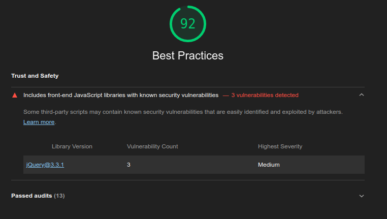

# SpaaceX Launch Programs

A website built to explore the different launches organized by SpaceX.
A coding assignment by [Publicis Sapient](https://www.publicissapient.com/)

## Tech Stack

- Front End
  - HTML
  - CSS
  - JavaScript
- API
  - SpaceX API
- Additional
  - Github Pages for Hosting
  - AWS Static Hosting

## Website is live at

- [Guthub](https://shivajit410.github.io/spaceX-launch-programs/index.html?)
- [AWS](http://spacex-launch-program.s3-website.ap-south-1.amazonaws.com/?)

## Lighthouse Score

## Problems

1. The Images are not being fetched from the SpaceX API, so in the website they are not being displayed
2. Didn't perform Test-cases
3. I don't have much knowledge of Server Side Rendering, so I have just fetched the data from the API and displayed it, though would love to study more about it.

## Learnings

1. Understood fair bit of how API works.
2. Initially thought of building the app via Angular but then converted to JS as it fulfills the requirement.
3. Prior focus was to build the website in such a way that the semantics would be perfect, no matter the device selected.
4. Lighthouse Reports is something that I usually think of exploring but never did until this project.
